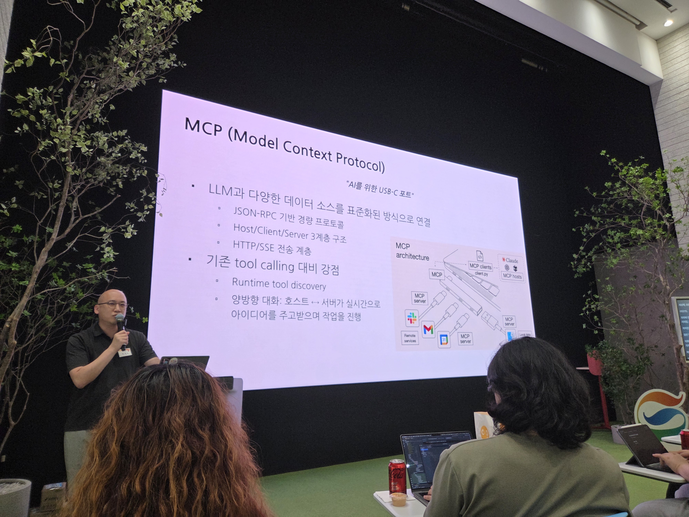
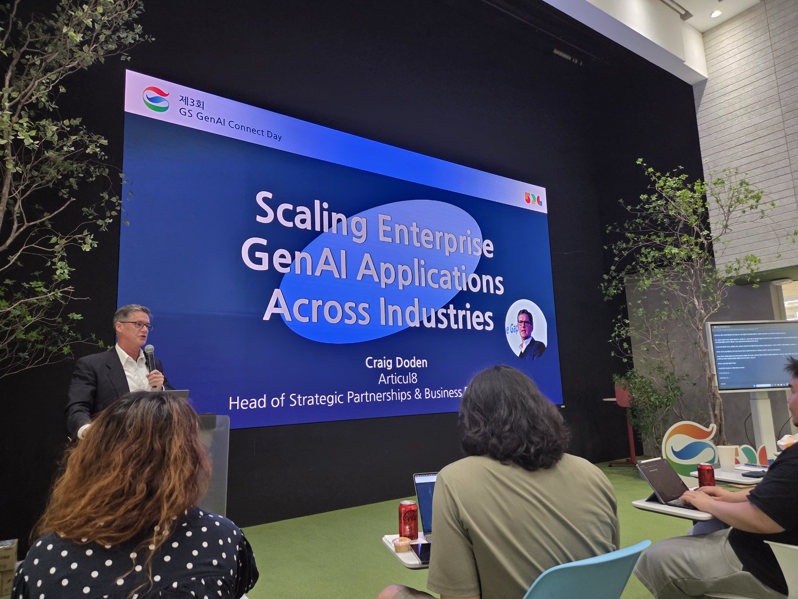
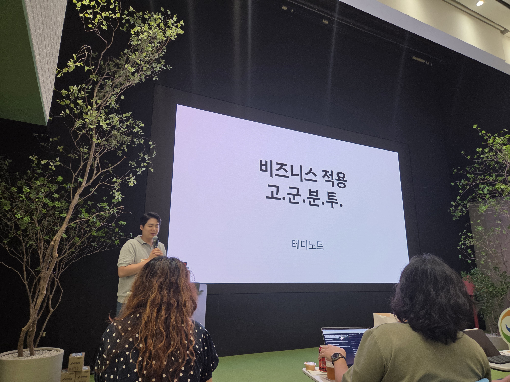
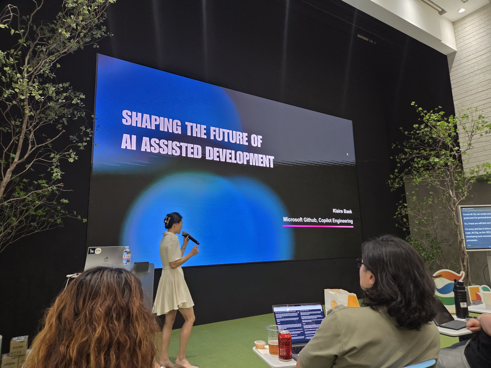

# 1. MCP 정말 안전하게 쓸 수 있을까?

🎙️ 연사: 허영수(52g 리드 엔지니어)

🏢 소속: GS

- MCP의 시작
    - 앤트로픽 내부에서 쓰려고 시작했다가 유명해진 케이스

- MCP 설계 철학
    - 정보 사일로 해소 → 새로운 데이터 소스마다 맞춤 구현이 필요하기 때문에 어려움이 있음

- MCP 개발 실사례
    - 토스페이먼츠
        - 개발자 문서 조회 MCP 서버 공개

    - Notion
        - Beta 버전 공식 오픈소스 공개 → 용도에 맞게 구조 개선 필요

    - AWS
        - 공식 깃허브에 코드 공개 → 용도에 맞게 구조 개선 필요

    - 비공식 오픈소스
         - 대부분 기존 API를 그대로 감싼 형태라 정보 불충분

         - 에이전트 입력 토큰 낭비 요소 및 보안 취약성 존재

- MCP 보안 취약성 원인
    - 개방형 확장성 우선 설계

    - 분산된 책임 구조

    - 생태계 수준의 구조적 문제
        
        - 예시
        
            - Slack link unfurling 취약점

            - SQLite SQL injection 버그
    - 검증 메커니즘 부족
        
        - 도구 진위성 검증 부족
        
        - 지속적 무결성 검사 부재

- 엔터프라이즈 적용 방향
    - MCP 서버 운영 지침 수립

        - 컨테이너 격리, 샌드박스 환경 실행

        - 기반서비스에 대한 최소권한 부여

        - 포괄적 모니터링

    - 충분한 테스트 기간 확보 및 점진적 적용

        - 도구, 정책, 사용자 역량 안정화 기간 필요

        - 정보 활용 순서
            
            - 외부 공개 정보 → 사내 일반 정보 → 사내 민감 정보

# 2. Scaling Enterprise GenAI Applications Across Industries

🎙️ 연사: Craig Doden(Head of Strategic Partnerships & Business Development)

🏢 소속: Articul8

- A8 platform
    - 기업이 다양한 파일 형식을 즉시 처리할 수 있게 함

# 3. 비즈니스 적용 고군분투

🎙️ 연사: 이경록(Teddy Lee)

🏢 소속: 브레인크루

- LLM 어플리케이션 개발 트렌드 변화
    - ChatGPT → RAG → Agent

- LLM 어플리케이션 개발 과정의 어려움
    - 문서가 많아졌을 때 RAG 성능이 떨어지는 것
    
    - Hallucination을 완전히 제거하는 것
    - 랭그래프 도입해서 사용 중

- MCP에 대한 의견
    
    - 사내 프로세스 개선 툴로 매우 적합하다고 생각

# 4. Shaping the future of AI assited development

🎙️ 연사: Klaire Baek(Copilot team staff manager)

🏢 소속: Microsoft Github

- AI 도입 필요성에 대해 고민해볼 것
    
    - AI를 빠르게 도입하는 것보다 "도입 목적"이 중요
        - 코파일럿 팀 사례
            
            - 팀 내에서 매뉴얼하게 진행하는 작업 리스트 정의 및 분석 → AI로 전환할 수 있겠다 싶은 부분을 찾는 방식 사용

- 개발자 커리어 관련

    - AI 툴이 잘 돼있기 때문에 오히려 코드 공부하기 좋은 시기
    
    - DS, 알고리즘 공부 소홀히 하지 말 것

    - 본인이 좋아하는 분야를 정하고 깊게 팔 것

# 소감