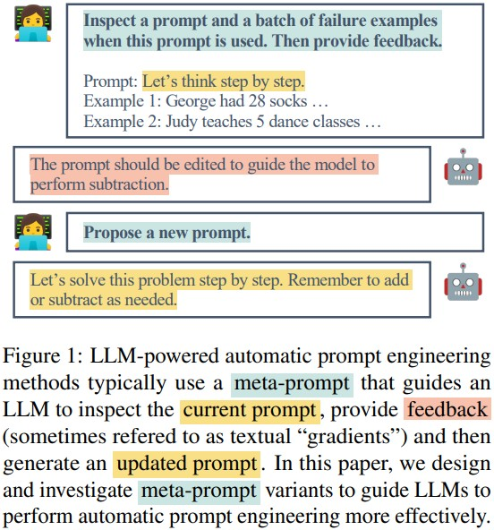
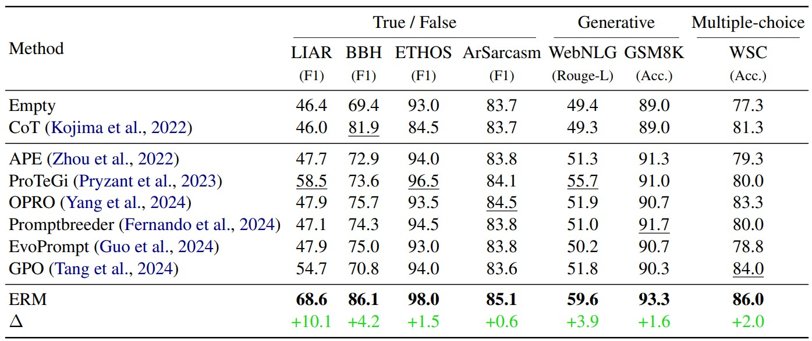
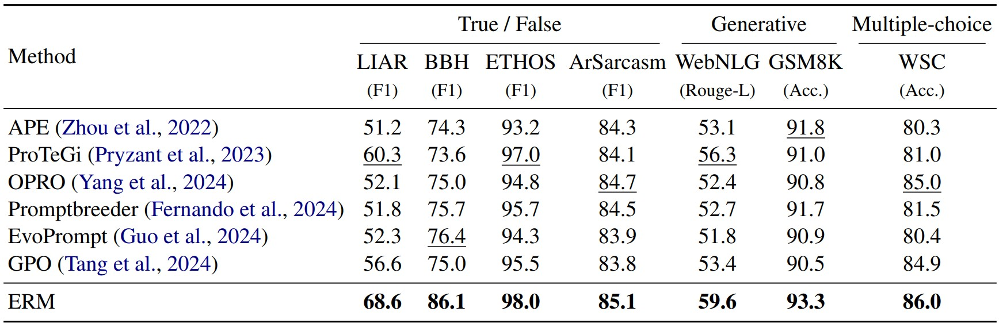
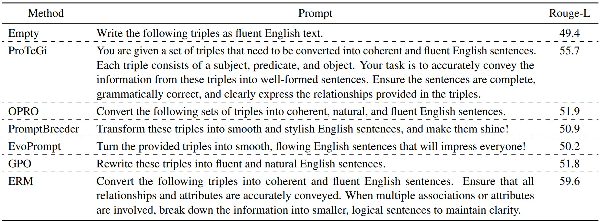
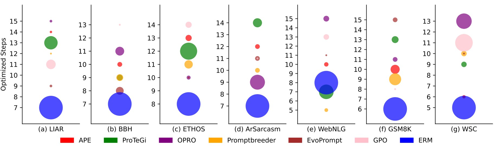

## Summary

- Automatic prompt engineering 분야에서 일반적으로 쓰이는 feedback-based prompt optimization의 단점을 극복하기 위한 **Exemplar-Guided Reflection with Memory mechanism (ERM)** 제안
    - Evolutionary-based methods, trajectory-based methods,  feedback-based methods 중 feedback-based methods 개선에 초점을 맞춘 연구
- 다양한 벤치마크 데이터셋으로 실험한 결과, ERM이 기존 연구들보다 최적화 단계는 적으면서 우수한 성능 확인

## Feedback-based prompt optimization

- 개념
    - 실패 사례(사용자가 원하는 결과를 출력하지 못한 프롬프트)에서 생성된 피드백을 활용해 프롬프트를 최적화하는 것
- 예시

- 동작 과정 (<u>section 3.1</u>)
    - Step 1. prompt initialization: manual 또는 induction
    - Step 2. new prompt proposal: 태스크 모델이 출력한 오답을 바탕으로 프롬프트 최적화 모델이 피드백 및 개선된 프롬프트 생성
    - Step 3. prompt search: 여러 개의 후보 프롬프트 중 validation set에서의 성능이 좋은 k개 프롬프트 선정
- 단점
    - 현재 선택되지 않은 피드백이나 이전에 생성된 피드백은 버려질 수 있음 → 과거에 실패했던 사례에서 얻은 피드백이 현재의 프롬프트 개선에 적용될 수 있더라도 이를 활용하지 못하게 됨
    - 예시의 '실제 효과'를 평가하지 않고 단순히 의미가 비슷한 예시를 추가하기 때문에 사용된 예시가 최적이 아닐수도 있음

## Method

### Component (1) Exemplar-Guided Reflection
.jpg)
- 프롬프트 최적화 모델이 더 구체적인 피드백을 생성할 수 있도록 실패 사례를 포함한 메타 프롬프트 전달
- 프롬프트 최적화 모델은 {error_samples}와 스스로 파악한 {exemplar}를 통해 프롬프트 개선점 도출

### Component (2) Feedback Memory
.jpg)
- Feedback memory storage
    - 피드백을 바탕으로 생성된 정제 프롬프트를 validation set으로 평가하여 성능이 향상된 경우에만 피드백 저장
    - BGE-M3 모델을 사용해 새롭게 생성된 피드백과 이전 피드백의 의미적 유사도 계산 → 유사도가 높으면 피드백을 저장하지 않음
- Feedback retrieval
    - 최적화가 진행되는 동안 feedback memory storage에서 우선순위 점수가 높은 피드백을 선택
    - 각 피드백의 점수에 따라 선택 확률이 정해지고 이 확률을 바탕으로 랜덤하게 피드백 선택
- Feedback forgetting updating
    - 프롬프트 최적화 모델은 선택된 피드백 그룹을 활용해 새로운 프롬프트 생성
    - Validation set에서의 성능에 따라 해당 프롬프트 생성에 쓰인 피드백 우선순위 점수 증가 또는 감소
    - Threshold 아래로 점수가 떨어진 피드백은 storage에서 삭제
### Component (3) Exemplar Factory
.jpg)
- Exemplar memory storage
    - 프롬프트 최적화 모델이 생성한 예시의 상세 풀이 과정이 실제 정답과 일치하는지 확인
    - 새로운 예시가 기존 예시와 동일할 경우 일정한 확률 `p`로 기존 예시를 교체하거나 `1-p`의 확률로 예시를 저장하지 않음
- Exemplar retrieval
- Exemplar forgetting updating

## Experiments
- 7개 데이터셋에 대해 F1 score, Rouge-L, Accuracy 측정
    - F1 score: LIAR, BBH, ETHOS, ArSarcasm
    - Rouge-L: WebNLG
    - Accuracy: GSM8K, WSC

## Result
- Comparisons of our method with existing LLM-based prompt optimizers **under zero-shot setting**

- Comparisons of our method with existing LLM-based prompt optimizers **under few-shot setting**

- Prompts optimized by different methods on the WebNLG dataset

- The efficiency of ERM
    - The size of the circles: 성능
    

## Limitations
- 최적화 과정 중에도 일부 질문에 대해 계속해서 잘못된 답변이 나올 수 있음
- 최적의 프롬프트가 항상 인간의 기대와 일치하는 것은 아님
- 비용 제약으로 인해 한정적인 태스크에서만 실험 진행