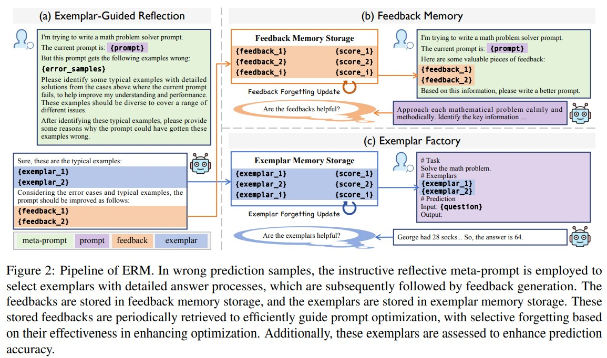

## Summary

- Automatic prompt engineering 분야에서 일반적으로 쓰이는 feedback-based prompt optimization의 단점을 극복하기 위한 **Exemplar-Guided Reflection with Memory mechanism (ERM)** 제안
- 다양한 벤치마크 데이터셋으로 실험한 결과, 기존 연구들(GPO, EvoPrompt, ...)보다 최적화 단계는 적으면서 우수한 성능 확인

## Background

- Feedback-based prompt optimization은 실패 사례에서 생성된 피드백을 활용해 프롬프트를 최적화하는 것
    - '실패 사례'는 사용자가 원하는 결과를 출력하지 못한 프롬프트
- Feedback-based prompt optimization 단계 (section 3.1)
    1) Prompt initialization
    2) New prompt proposal
    3) Prompot search
- Feedback-based prompt optimization의 단점
    1) 현재 선택되지 않은 피드백이나 이전에 생성된 피드백은 버려질 수 있음 → 과거에 실패했던 사례에서 얻은 피드백이 현재의 프롬프트 개선에 적용될 수 있더라도 이를 활용하지 못하게 됨
    2) 예시의 '실제 효과'를 평가하지 않고 단순히 의미가 비슷한 예시를 추가하기 때문에 사용된 예시가 최적이 아닐수도 있음

## Method

### Component (1) Exemplar-Guided Reflection
- Instructive meta-prompt를 사용해 prompt optimizer가 typical wrong samples를 식별하고, 각 샘플에 대해 상세한 풀이 과정을 제공하는 exemplar를 생성하도록 안내하는 단계
    - Prompt optimizer는 개선된 프롬프트를 생성하는 역할의 언어 모델을 의미함
### Component (2) Feedback Memory

### Component (3) Exemplar Factory
- 예시

    

## Experiments

## Limitations
- 최적화 과정 중에도 일부 질문에 대해 계속해서 잘못된 답변이 나올 수 있음
- 최적의 프롬프트가 항상 인간의 기대와 일치하는 것은 아님
- 비용 제약으로 인해 한정적인 태스크에서만 실험 진행