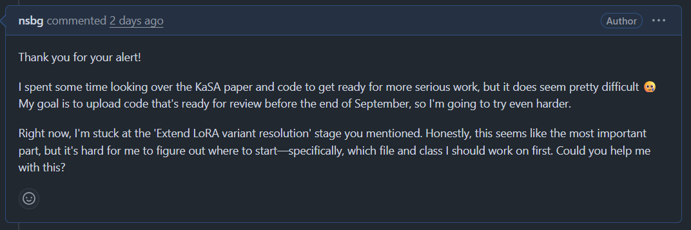
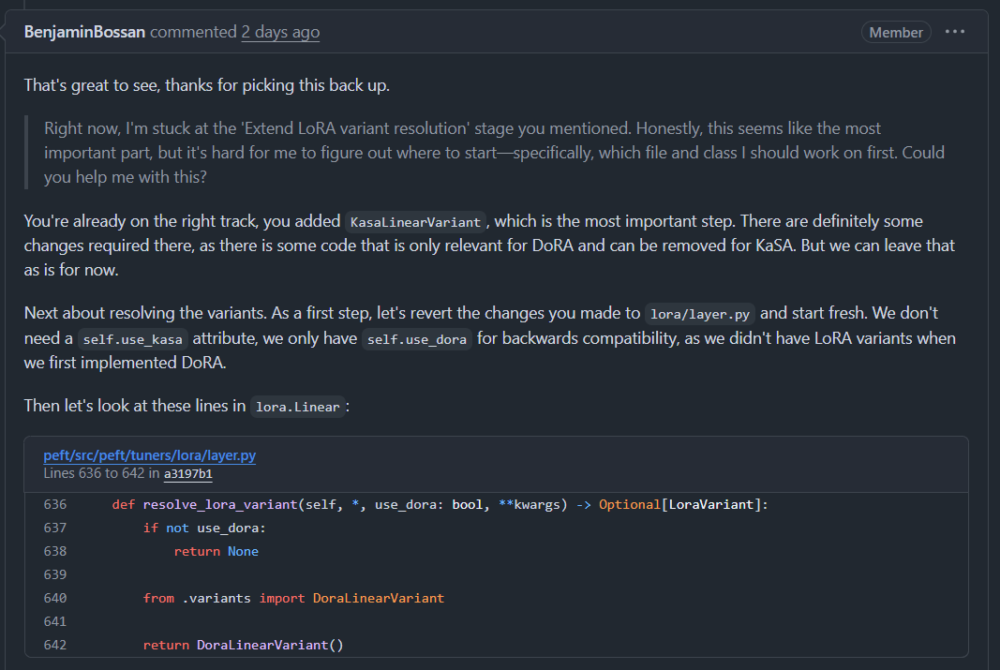
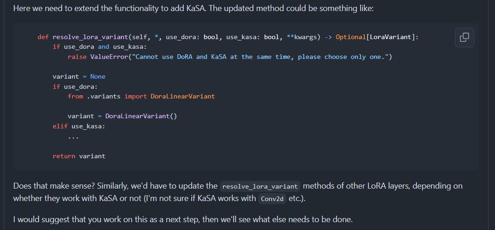

일단 막 적어놓고 작업 끝나면 정리해야겠다.

기존 kasa 코드: 그냥 peft 라이브러리 안에 바로 구현한 듯

hf에서 원하는 방향: 사용자가 활성화했을 때만 쓸 수 있게 클래스로 따로 빼는 것

### Benjamin guide (1)

이 단계 작업하다가 어떤 파일을 어떻게 수정해야하는지 아예 감을 못 잡음

그래서 질문 남김

### Benjamin guide (2)
그는 천사였음

이걸 꼼꼼하게 읽어보자.