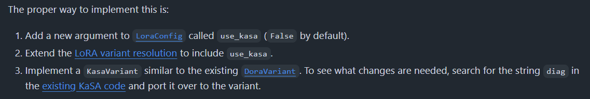

일단 막 적어놓고 작업 끝나면 정리해야겠다.

기존 kasa 코드: 그냥 peft 라이브러리 안에 바로 구현한 듯

hf에서 원하는 방향: 사용자가 활성화했을 때만 쓸 수 있게 클래스로 따로 빼는 것

### Benjamin guide (1)

이 단계 작업하다가 어떤 파일을 어떻게 수정해야하는지 아예 감을 못 잡음

그래서 질문 남김

### Benjamin guide (2)
그는 천사였음

- KasaLinearVariant 추가해뒀는데 이게 가장 중요한 거라 제대로 추가한 게 맞음

- 하지만 KasaLinearVariant 내부 코드 변경 필요

    - DoRA에만 해당하고 KaSA에서는 불필요한 코드가 일부 있기 때문
    
    - 근데 이 작업이 지금 우선순위는 아니라서 변경해야 한다는 것만 인지하고 있으면 됨

- lora/layer.py에 self.use_kasa 속성을 추가해놨는데 이건 필요없음

    - self.use_dora는 과거 코드와 호환성을 유지하려고 있는 것뿐임